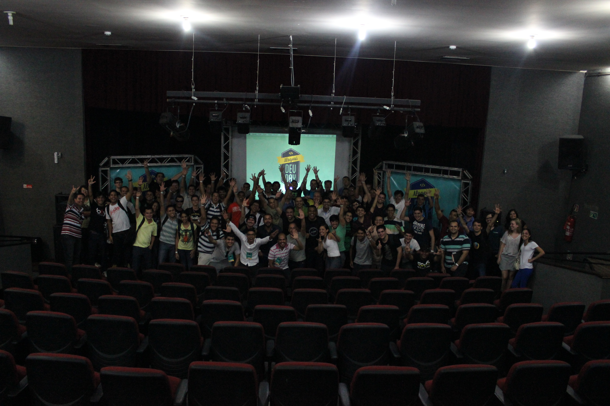
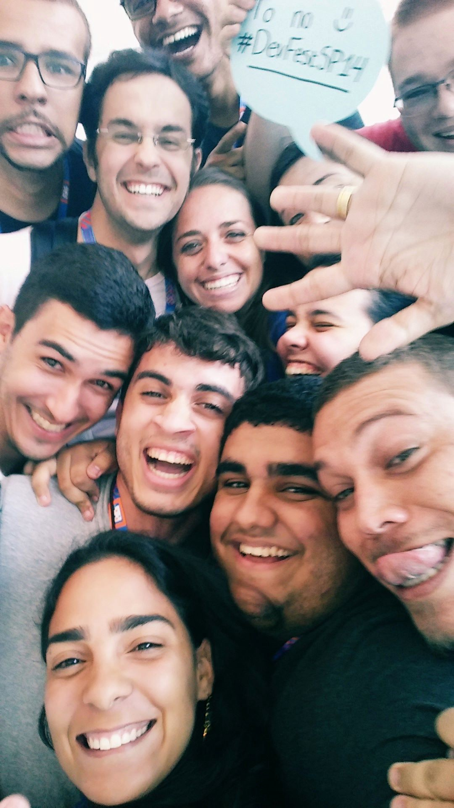
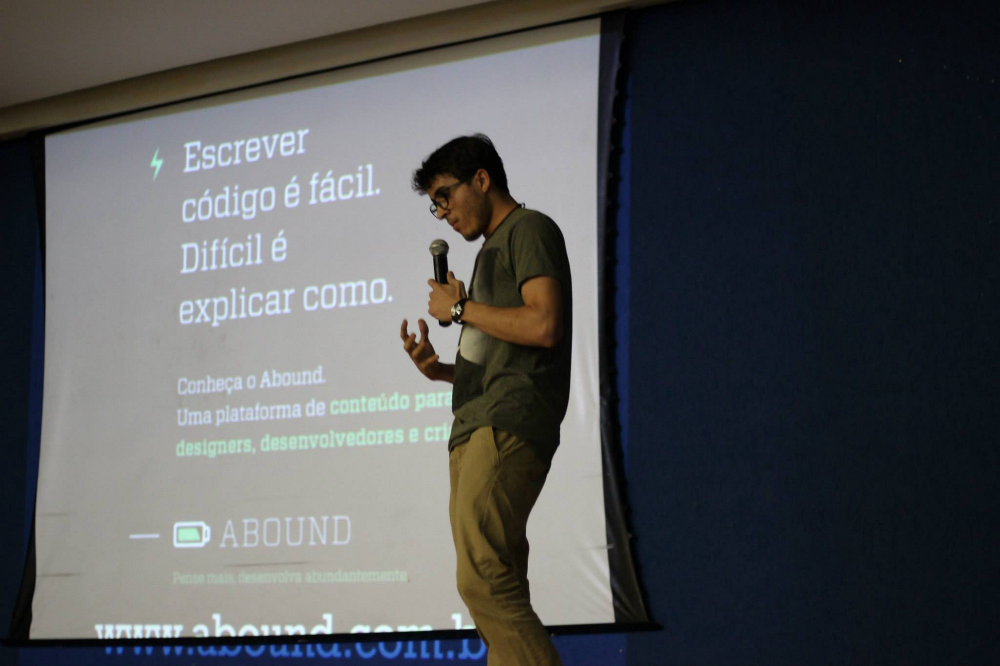

> How the influence of many professionals have helped me to become what I am today.

Many factors can influence on how we overcome obstacles in our life. Such challenges normally happen when we face many uncertainties, hence, providing us with choices that can change how our life can turn out to be.

Many of our victories can be dedicated to all the mentors we have known throughout our lives who have somehow helped to guide the path we have decided to pursue without asking for anything in return. Subliminally, with many times the desire to see you overcome your obstacles and walk a path to success.

A simple gesture of effort to show how something works, a minute to suggest something to read, an encouraging lecture to never give up, or even advice to avoid doing such things. All of this contributes to the way we think and how we can plan what we want for our future.

## For those who don't know where to go, should any destination be good?

I remember just like it was yesterday, the day I got to play with my `first` computer. I've been always a curious guy for many things, especially when it had to do with technology. My dad's friend helped me configuring everything and I started using/learning as much as I could.

For a long time, this friend helped us to format/install our computer when it was slow or abducted by víruses (LOL). That was the time I started thinking about doing that as a professional.

I learned with a friend, the step-by-step of how to install and configure a computer, and it got me very interested about how everything worked. With eleven years old, I deciede that I wanted to study way more thant I was able at that time. Nothing was easy when you're a fella who lives in a small city, which is also located in a small state. Believe or not, I could find myself waiting until midnight, so I could start using internet with my Old fashion moden. For many years I was the little IT kid in the block, that never stopped me to have dreams about something bigger.

Sometimes I keep thinking about what would have happened If I haven't had met those people that for sure had a big influence in my life to keep porsuing more knowledge. Have you stopped to think about what would *you* be without people like that in your life?

Nowadays many people don't know what to do before they start a degree in a university. Usually when they think about something, they are not really sure of what is the real meaning or what happen in a profession.

Informally I was influenced by people close to me, but not everyone is so lucky. I hope one day it will be better introduced in our education system.

## Sometimes we just need a little push

They say that developers acquire what's called Impostor syndrome throughout their life. I can say that I had that even before I started. Even though people would say the opposite, I always thought anything I did was not good enough to show to someone. Many times because even close people would not appreciate it enough in many attempts.

In university sometimes we got the opportunity to attend to some programming events, and that was when I met one of my old friends, `Juarez Filho`.

Maybe he doesn't know that until he reads this post, but my first programming internship had some contribution from his actions in my university. I remember being very insecure about participating in a CakePHP course because I was not feeling very good about PHP at that time and needed a little push (encouragement) in order to attend the course.

After this day, I never stopped. I studied more and more and ended up getting 2 internships because of that workshop. Many people are responsible for many choices I took, many successful choices, but some very unfortunate. Even though, it for sure contributed to my critical sense, helping me to improve the way I can think about situations and how to choose a good path for my life.

I think if we have more guides like those people, the community would provide way better professionals with a better attitude. Attitudes that can help other people with the "little push" they may need, without expecting anything back. Something that in the end is extremely grateful.

## If the life gives you a lime, make a caipirinha!

Nothing was easy, unfortunately I was from another city, my internship was in the state capital, I had to consequently move, not knowing many people. Before that, I always had to go to college by bus, it was an average of 1 and a half hours to go and an hour and a half to get back, a lot to discourage.

I can say that one of the most decisive moments that totally contributed to my career was in my second internship. I was about seventeen, I think. The owners of the company (now friends) were at a level above the market. My internship assignment was not so trivial (haha). Stuff like: "Document this framework into object-oriented PHP in English, then create a template system in Smarty and generate the framework documentation."

Just imagine, I did not know any English, I was beginning to understand object orientation and finally Smarty was all in English and very complicated at the time. There were days when I went to work and beat that discourage for not being able to solve the problem.

I spent hours reading to try to "decipher" what I was doing wrong. For a long time I worked with maintenance and computer networks, so finally, I even thought about giving up programming because I thought it was really bad at it.

Luckily I was always mentored by the two partners of the company, which ended up making me better understand the whole process and how to do each task. Finally when I finished, I felt very happy, I never thought to do anything like this or much less work with a framework created in the company itself.

Sometimes I stop to think what I would have done if my bosses had not helped me and understood the difficulty of it all for me. Would I have continued to program?

## Conferences, conferences, conferences, conferences!

"Dang!, this person leaves their house to go to lecture in another city and does not get paid for it". I've heard a lot of people say that, sadly.

People need to learn the value they do not have by networking and listening to someone with experience speaking at events. Such people have gone through difficult times trying to solve a certain problem in a particular domain that will often save you from going down the same painful path.

In events, I met people who for many times contributed in a great way to the professional that I am today. And luckily, they got me some really nice jobs (hehe).

So get out of your comfort zone and invest in communication and learning, because if you are not seen, you are not remembered. Nothing will be easy if you don't leave your house to meet people and learn from all these experiences.

As one of the organizers of one of the biggest events in my state (Alagoas Dev Day), I know how difficult it is in Brazil to do something like this.

So when I know of some interesting event that fits in my pocket I always try to go. In the events that I attended I saw many opportunities to appear, I met extraordinary people and consequently many people sharing very interesting stories that surely would never know if I had stayed at home.

> Keep calm and let’s go!

## Be a guide and help to create the next generation that will change the world

I'm happy for today (even with so many craps) programming communities have been growing a lot, and several mentors have been appearing every day. A simple gesture of help and guidance can contribute to a better career path for many people.

I try hard to contribute with career guidance from many friends and even in the life of those who have not yet decided what to do in life, showing at least what can happen if this person is in the programming area. Often with projects like the Remote Work Guide, or just with information on how I currently work.

Sporadically people just need that older brother's sermon to talk about what's wrong and how to get better. I feel that a lot of them have grown a lot like professionals after that and in a way, it's very gratifying for me.

It is quite clear that I will not be able to create a revolution yet, but I am doing my part. So if you know a little, or have enough experience to help someone, do not think too much help! The feeling you have of seeing someone you helped succeeding is indescribable. In a way, you are helping to create a new generation that will change the world!
