> Um “pequeno” relato sobre minha história em Austin-TX.

Primeiramente, caso não me conheça, meu nome é Ivan Santos, originalmente de uma cidade no interior de Alagoas (Viçosa-AL), nesse exato momento tenho 24 anos, atualmente moro na California ( :O ) e sou Engenheiro de Software em uma startup bem legal em Orange County.

Felizmente minha experiência no Texas foi dividida em 2 momentos: Com inglês e sem inglês.

Isso mesmo. Tive a oportunidade de ir pela primeira vez para um treinamento em um projeto na cidade e fiquei por 6 meses. O assustador disso tudo é que meu inglês n passava de Google Translate e muito… MAS MUITO Verbo TO BE (Foi o q vi no ensino médio haha).

Imagina só, um Brasileiro do interior pela primeira vez fora do seu país e zona de conforto. Pelo contrário do que muita gente imaginava, isso não me afetava muito, aceitei de peito aberto o desafio e aproveitei cada minuto. Mesmo com muitos momentos difíceis e estressantes, posso dizer que nesses 6 meses aprendi muito, fiz vários amigos e voltei com muita história pra contar.

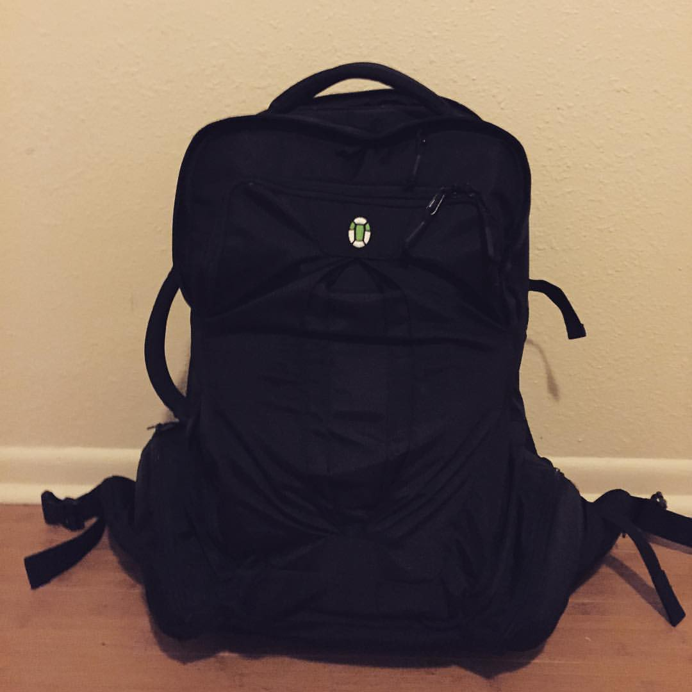

Mas a parte mais marcante foi quando decidi juntar grana, vender muita coisa que eu tinha e partir para um ano sabático nos EUA, onde finalmente aprenderia inglês no modo “vale-tudo”, e não é por menos que resolvi voltar para Austin, nada melhor do que um ambiente amigável para começar a se adaptar progressivamente. Onde incrivelmente homesick (saudade do Brasil) se resolve indo pra um Food Truck ou reunião com amigos.

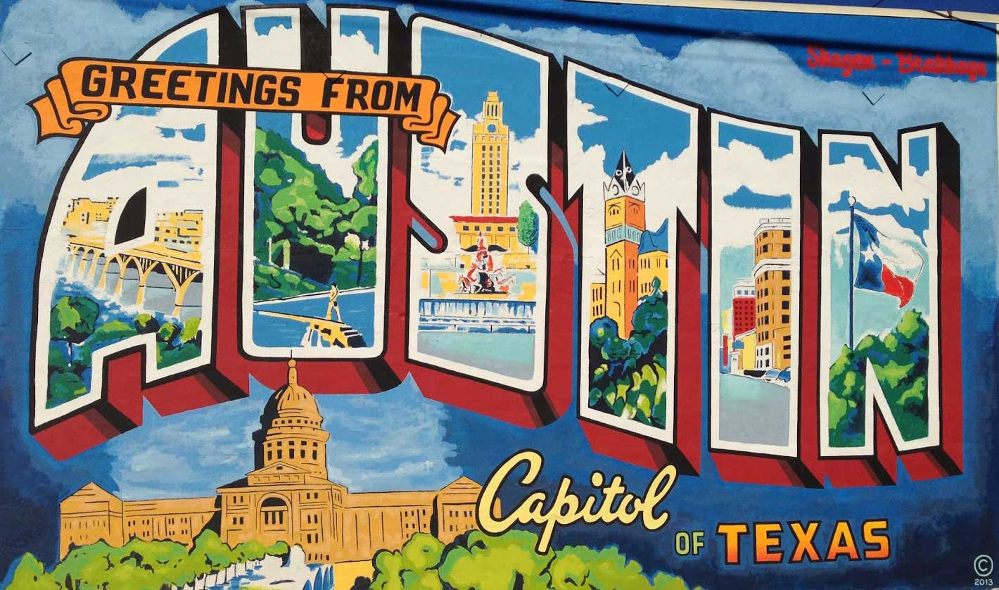

A maioria dos brasileiros que conheço por esse mundo afora provavelmente já deve ter ouvido falar do Texas, normalmente de Houston e Dallas, por serem as duas maiores cidades do estado. Incrivelmente ainda rola aquela “má formação de conceito” sobre ser um Texano (cowboys LOL), provavelmente pelo grande número de filmes de ‘Faroeste’ que foram filmados e baseados nas localidades, mas deixo isso pra um próximo bate-papo.

Muitos como eu se surpreendem que nenhuma das cidades citadas acima é a capital do estado. A capital é minha cidade favorita até o momento, Austin, conhecida por ser a ovelha negra do Texas e também por ser uma das cidades com maior ocorrência de shows ao vivo dos Estados Unidos.

Um fato importante, e que provavelmente você já sabe. Texas é QUENTE, mas BEM QUENTE MESMO! Porém não tem muita humidade, então esquece esse lance de ficar suando igual a um porquinho na rua.

## Keep Austin Weird!

Para compreender o porquê do termo Ovelha Negra, é necessário aprender um pouco sobre o contexto atual da cidade. Existe um termo em inglês chamado “Melting Pot”, que significa um lugar onde pessoas, estilos, teorias e pensamentos são diferentes e vem de lugares diferentes e que sobrevivem em harmonia (ou não haha).

Austin é uma cidade universitária, sede da UT (University of Texas), uma das maiores universidade do país, onde fica um campus que abriga mais de 50 mil alunos em cursos de graduação e pós-graduação. Essa quantidade de pessoas jovens vindas de muitos estados e países diferentes fazem com que a forma de lidar com situações do cotidiano sejam tratadas de forma diferente do resto do Texas.

Entretanto, os Texanos conservadores acham os “austinites” modernos e esquisitos demais comparado as gerações passadas (hipsters? haha).

Austin é uma cidade bem progressista, foi a primeira a ter um programa de reciclagem, não permite que fume em nenhum local público e tem um movimento cultural/empreendedor muito grande chamado “Keep Austin Weird” (Mantenha Austin estranha).

Austin tem uma das maiores cenas Artística e culturais dos Estados Unidos, e é por isso que cada vez mais, grandes empresas são atraídas para operações na cidade.

A cidade vem cada vez mais abrigando multinacionais e empresas com alto conceito em tecnologia como AMD, Apple, IBM, Dell, Facebook, Blizzard e Zynga, nada que me cause surpresa, os benefícios financeiros e de custo de vida são surpreendentes comparado a California.

## Um tempinho para sua saúde

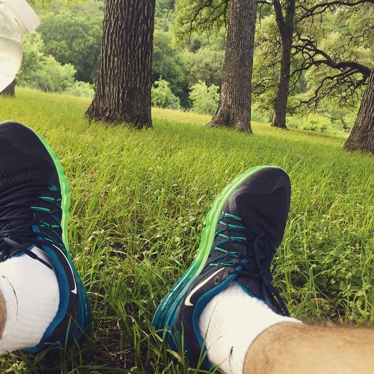

Inicialmente me surpreendeu um pouco o que vem a seguir: depois de ser bombardeado por informações relativas a obesidade nos EUA, descobri que a coisa não é bem assim. Depende muito da cidade e do custo de vida. Austin cada dia veio provando que é uma das melhores cidades para viver bem e com saúde.

Constantemente a qualquer horário do dia da pra ver pessoas correndo, andando de bicicleta, jogando voleibol, e incrivelmente Futebol (Não falo de futebol americano) é algo bem comum. É bem normal em um dia você descobrir que está rolando uma Maratona, e que muitos estudantes e civis participam.

Quando se vai morar em outro país, consequentemente alguns hábitos vão mudando e se moldando para se adaptar ao estilo de vida do lugar. E felizmente isso aconteceu aos poucos comigo.

Austin é também uma das cidades onde mais se pratica voleibol, e é bem fácil encontrar vários meetups para todos os níveis. Então se vc é um tremendo de um desajustado ao lidar com uma bola, ainda resta esperança pra você.

## I’m Hungry!

Vamos falar do que mais interessa, COMIDA! (nesse exato momento estou com muita fome).

Uma das características bem marcantes do Texas como muita gente sabe é a comida, para ser mais específico, o Estado é bem conhecido em geral por ter um dos melhores Churrascos (BBK) dos Estados Unidos. Austin faz jus ao título do estado, muitas vezes me deparei com os melhores Ribs que comi na vida, tudo feito com muita paciência e amor ❤.

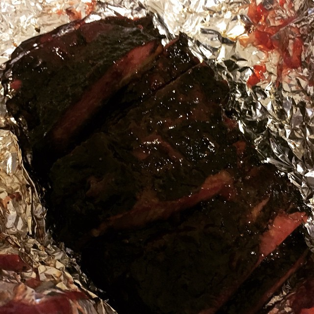

Por falar em Barbecue, não poderia deixar de falar sobre Franklin Barbecue.

Em dias quentes ou chuvosos, sempre esteja preparado para esperar uma das maiores filas para comer que você já viu na sua vida. Relatos de pessoas chegando 7 da manhã e só conseguindo comer 12 horas são bem constantes e pra piorar eles só abrem 11 da manhã.

E aí você se pergunta, mas por quê eu iria fazer isso? Junto com tais relatos, a maioria são acompanhados de um “valeu cada minuto na fila”. Então, prepare seu guarda-chuva e sua cadeirinha dobrável, pois a espera vai ser longa.

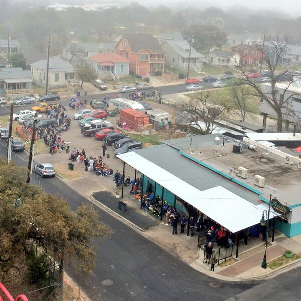

Declarado como o Melhor Barbecue dos Estados Unidos pela Revista Bon Appetit, o restaurante vem atraindo muitos fãs de todo o mundo.

Infelizmente não tive força mental para me aventurar nessa fila, quem sabe um dia.

Mas não é só de Barbecue que vive o Texano, tem comida de todos os lugares do mundo, e feito por pessoas de todos os lugares do mundo também.

Vivendo em uma Capital em um estado consideravelmente pequeno (Alagoas) no Brasil, posso dizer que não temos tantas opções de comida ainda. Foi um choque grande pra mim, poder conhecer o sabor de comidas de vários países diferentes apenas visitando bairros diferentes na cidade. Isso é muito fascinante!

Incrivelmente foi em Austin que comi Sushi pela primeira vez. Isso, não faz sentido mas é por aí mesmo. Muitas pessoas acham que por estar um pouco longe do mar, os peixes não são frescos o suficiente. E eu acho que isso é um mito, os restaurantes usam um serviço de uma empresa que especializada em entrega de produto fresco para muitos restaurantes Asiáticos. Não posso reclamar ainda, mesmo morando na California, onde o sushi é um dos melhores.

Depois de alguns meses finalmente você se da conta de que ta faltando alguma coisa. Aquele pão de queijo, feijão com arroz, cuscuz e lasanha da vovó começam a fazer falta, e você finalmente entra em estado de Homesick.

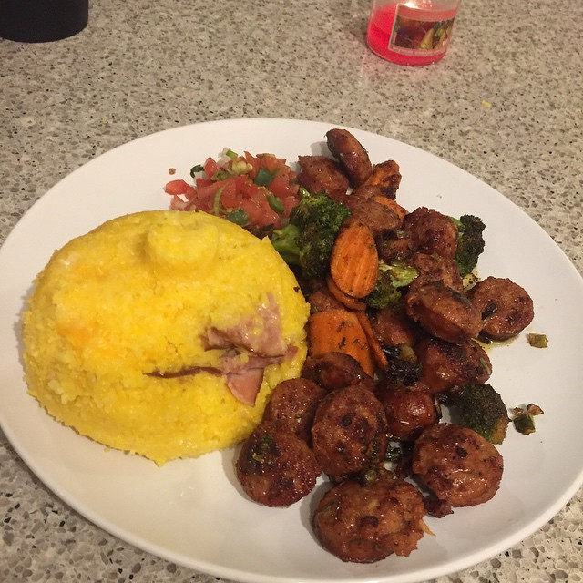

E é aí que entra o supermercado Fiesta (não estou ganhando nada com a propaganda ;/)! Onde você incrivelmente vai encontra muito ingrediente normalmente usado no Brasil, ex: Cuscuz e Leite Condensado.

Da pra bolar aquele prato típico (ou não) nordestino que sempre foi sua rotina (universitária).

Mas se caso você não seja tão aventureiro na cozinha quanto eu. Seus problemas acabaram, lhe apresento um dos melhores Food Trucks de Austin, o “Boteco”.

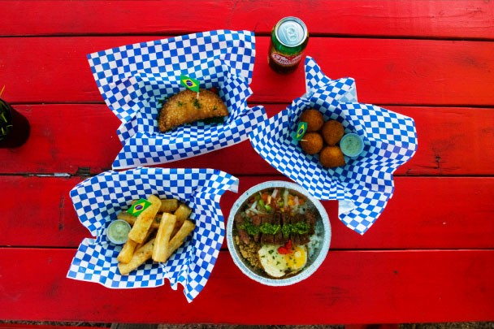

Sim, um Brasileiro está listado entre um dos melhores Food Trucks de Austin. E não basta ter uma ótima comida, tem Brasileiros, e muitos!

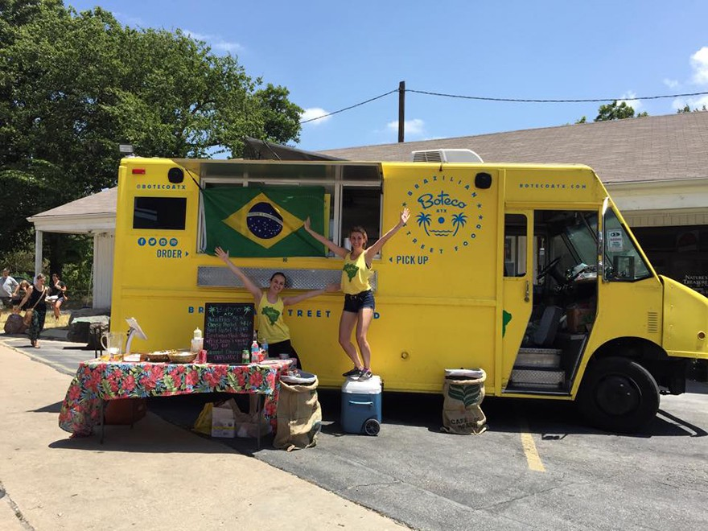

Fernando, o dono do Boteco consegue produzir vários pratos típicos Brasileiros com aquele toque especial para deixar qualquer amante de Street Food ficar de boca aberta. E é claro, salivando de fome.

Facilmente é um ótimo local para trocar uma ideia em português, trabalhar remoto, assistir aquele futebol no fim de semana e mensalmente até curtir um samba e forró ao vivo.

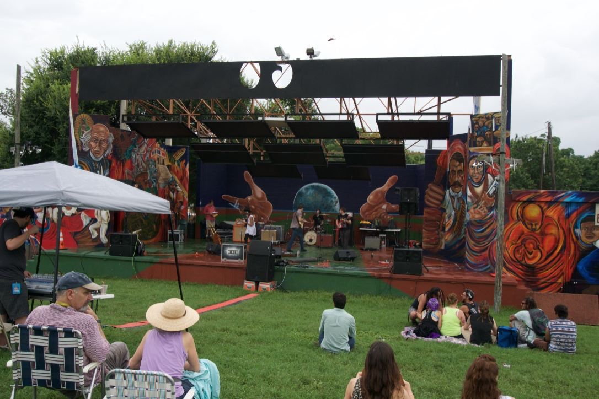

## Hey! How, let’s go! (8)

Poderia passar o dia descrevendo o quão fácil é preencher sua agenda com saídas noturnas, e não falo da boca pra fora, se você pensar em sair todos os dias, posso garantir que com certeza irá encontra algo legal para fazer, e isso muitas vezes inclui música ao vivo.

Por ser eclético, facilmente posso dizer que Austin tem entretenimento que agrade vários gostos, desde música Country até Heavy Metal.

Nesta jornada, uma das lições mais valiosas que aprendi foi, “não fique em casa”. Qual o sentido de morar fora e continuar levando sua vida “normal”?

O conselho que eu dou é: não só de escola vive um estudante de inglês! É isso mesmo, posso dizer que metade do que sei hoje aprendi na rua, saindo todos os dias, conhecendo pessoas novas, estando aberto a novas culturas e coisas que muitas vezes não faziam sentido pra mim.

Isso me transformou de uma forma tão boa que só fez aumentar minha vontade de conhecer o mundo. Acho até que passagens aéreas deveriam ser mais baratas, fazendo com que conhecer outros países fosse acessível a todos.

Então, voltando a falar de Vida Noturna, Austin não deixa a desejar nenhum pouquinho. Irei falar um pouco sobre os lugares que eu costumava ir.

## 6th street

Não tem como falar sobre Austin e deixar a 6th street de fora. Para quem não sabe, algumas cidades nos Estados Unidos tem ruas numeradas no centro. Também conhecida como Dirty 6th, esta rua pode ser dividida em 3 partes, as mais conhecidas são East 6th (Leste), Central e West 6th (Oeste).

## East 6th street

East 6th é marcada por bares frequentados por Jovens que já estão no mercado de trabalho e geralmente não frequentam mais um College. O bar que eu costumava ir não era exatamente na 6th mas era bem perto, se chamava The White Horse.

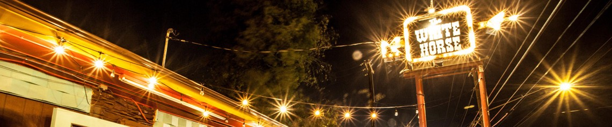

The White Horse é um dive bar bem antigo frequentado por pessoas de várias idades e estilos. Muitas vezes era bem fácil encontrar Pin Ups, Hipsters e Country Music Fans no mesmo lugar. A diversidade de pessoas e bebidas nesse bar é fantástica! Dependendo do dia é possível tranquilamente ouvir Country Music, Rock e até mesmo Swing Dance Music. Se você pensa em se familiarizar com as danças do Texas, esse bar é um bom começo, as vezes eles tem aulas grátis de 2 step dance (country music).

## Dirty 6th street

Levei um tempo para entender o termo “Dirty 6th street” (sexta rua suja), que representa a parte central da rua, com dezenas de bares todos pertinho um do outro. Trata-se de uma parte bem grande da rua, onde milhares de pessoas, geralmente estudantes da universidade da cidade, vão para se divertir, beber e confraternizar (loucamente até cair) com os amigos.

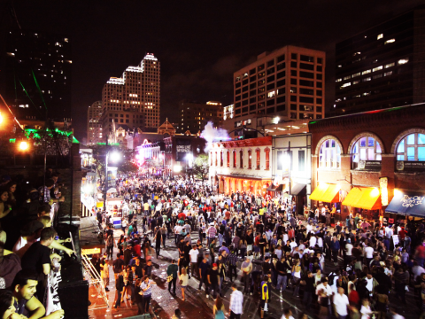

O Termo Dirty vem da mudança em horas decorrentes. Tudo começa bem limpo e organizado. Perto de 1 da manhã, o caos começa. Pessoas super bêbadas, algumas brigando, outras sendo carregadas e muita polícia na rua.

Entretanto, não deixe a parte “Dirty” da rua afetar seu julgamento, é definitivamente uma experiência que deve ser vivida mais de uma vez.

Cada bar tem um contexto diferente e bem interessante. Sugiro não privar sua noite de nenhum, VÁ EM TODOS.

Por fim, não deixe de visitar o melhor deles. Aquele que salva sua noite de melancolia, com as melhores músicas pop dos anos 80, onde provavelmente irá conhecer muitas pessoas com quem vai fazer amizade facilmente.

Este bar se chama “Barbarella”. Eu acho até que deveria ter uma versão deste bar para cada capital de estados nos EUA, de tão legal que é. Quer saber mais sobre esse bar? #Descubra.

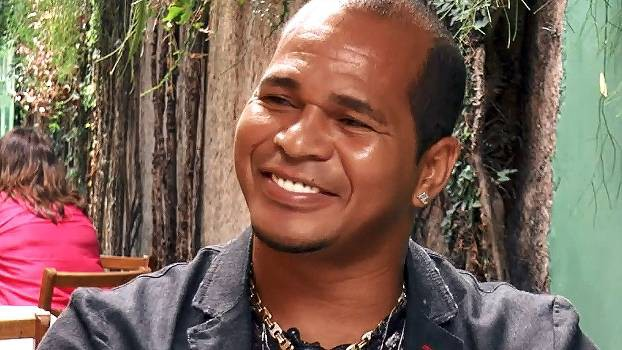

## West 6th street

Posso resumir West street como a parte “fancy” (luxuosa) da rua. Onde você irá encontrar vários restaurantes e bares onde pessoas mais velhas e um pouco mais bem sucedidas frequentam. Não fui muito nessa parte da rua, mas tem um Nightclub chamado Rio que é bem legal, vale a visita.

## Wild West

Vivendo no norte da cidade tive a oportunidade de entrar no mundo de Country Music, e foi aí que conheci o Wild West, é um bar onde todos vão para aprender e dançar um bom country.

A dica é sempre ir na quarta feira, onde mulheres entram de graça, e todos os Drinks tem desconto. Nada melhor do que conhecer a cultura do Texas do que indo para um bar com um tema realmente Texano.

## Austin City Limits

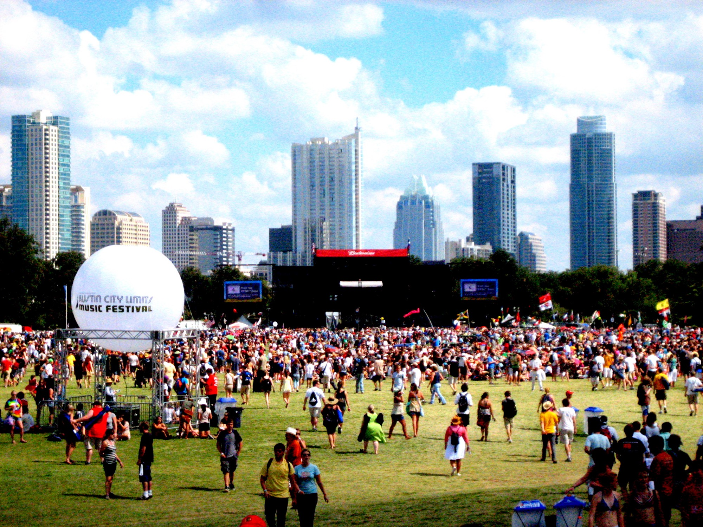

Austin é bem conhecida por seus vários festivais de música. E por falar em música, é impossível deixar de comentar sobre Austin City Limits.

Conhecido por ser um dos maiores festivais de música ao vivo dos Estados Unidos, é dividido em 2 fins de semana, com dezenas de bandas e muitas delas locais.

Nos anos que fui, tive a oportunidade de curtir bandas como Arctic Monkeys, Vampire Weekend, Muse, Foo fighters e outras bandas do gênero que pelo que você pode ler são mundialmente conhecidas.

## South by Southwest

Se trata de um Mix de Cinema, Música e Empreendedorismo.

South By Southwest é um dos eventos anuais que consegue trazer muita gente de vários lugares do mundo para apresentar/discutir/curtir muitas coisas em vários ecossistemas.

É dividido por dias relativos a produção audiovisual, música e startups. Geralmente um ótimo lugar para você apresentar seu negócio caso ele seja promissor.

Na temporada desse evento a cidade inteira foca em tudo relativo a isso.

## Hora de estudar

Não é necessário falar muito sobre Ensino superior em Austin, pois a própria University of Texas já mostra o nível e oportunidades para muitas áreas na cidade.

Quando se trata de escolas para crianças, minha única experiência é relativa com o norte da cidade nos distritos de Round Rock e Leander, ambos com notas altas para o distrito inteiro, e com muitas opções de escola caso você pretenda morar lá com sua família.

O sistema de transporte escolar parece ser muito eficiente a propósito. A maioria dos Brasileiros que conheço em Austin mora no Norte, e seus filhos estudam nessas determinadas áreas.

## Inglês

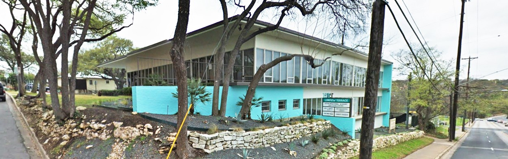

Aqui vai minha contribuição para o objetivo real da minha segunda viagem.

Uma das coisas que sempre recomendo aos meus amigos é cair de cabeça na cultura e idioma de outro país. Acho um pouco ineficiente a forma de estudar inglês nas escolas do Brasil. Mas aí vai de caso para caso.

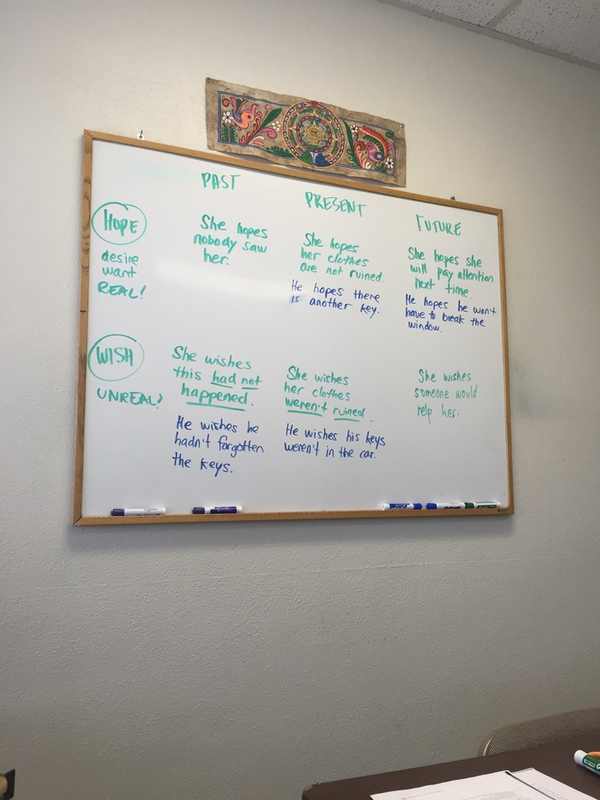

Austin tem várias escolas de inglês, mas é claro, irei falar da escola que estudei, por ter contribuído muito para o meu conhecimento atualmente.

[Aston International Academy](http://www.astonusa.com/), é uma escola que claramente se preocupa com os seus alunos, é impossível não perceber o empenho de todos os professores e diretores quando se trata de fazer com que seu dinheiro valha a pena.

Aprendi muito tanto sobre inglês, quanto sobre a cultura dos Americanos.

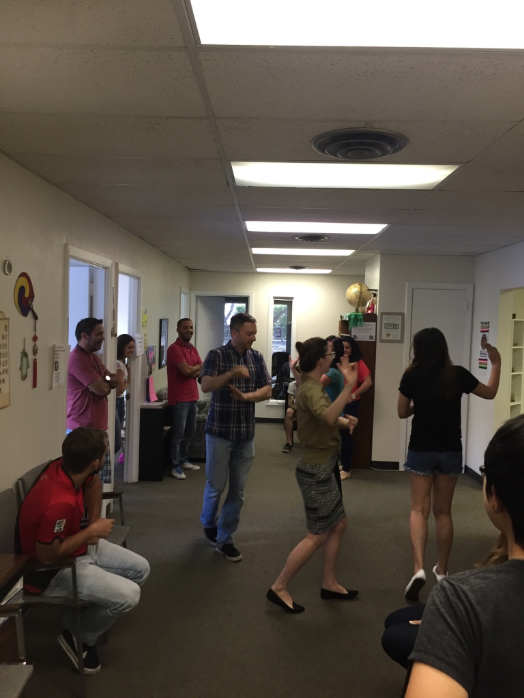

Estando nessa escola tive a feliz oportunidade de conhecer e compreender a cultura de vários países, tais como Tailândia, Vietnam, México, Colombia, Venezuela, Arábia Saudita, Turquia, Japão, China, Espanha e até mesmo Brasileiros. Tenho certeza que abriu muito minha mente para compreender as coisas com uma visão maior.

Geralmente a escola tem atividades semanais que incluem visitas em lugares históricos como Museus, parques municipais e até mesmo happy hour para tomar aquela cerveja especialmente criada no Texas.

Posso dizer que a experiência nesta escola foi singular! Recomendo muito caso esteja pensando em estudar inglês nos Estados Unidos. E o melhor, comparado com outros estados, escolas de inglês no Texas são consideradas mais baratas \$\$\$\$.

## Transporte

Posso dizer que transporte público em Austin é algo que deixa um pouco a desejar. Não pela qualidade, mas pela quantidade. Eles tem um sistema de trem que vai do extremo norte até o centro da cidade. Usei muitas vezes quando morava no Norte.

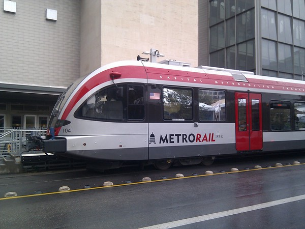

A quantidade de ônibus no Norte é um pouco reduzida, porém se você precisa de algo perto do Centro da cidade, é bem fácil se locomover. Tudo com ajuda do Google Maps, pois a cidade tem todo o seu sistema de transporte integrado.

Um fato interessante é que todos os ônibus são acessíveis para deficientes e felizmente existe um suporte frontal para bicicletas, e é aí que pode começar uma nova paixão por pedalar, pois distâncias não são mais um inconveniente.

Considere trabalhar enquanto vai para algum lugar, a maioria dos ônibus e também o trem tem internet wireless.

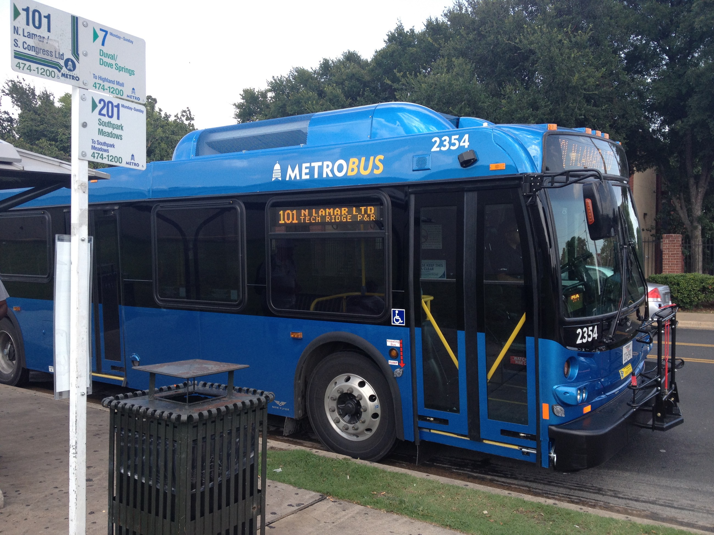

Mas o queridinho da cidade vem agora: Car2Go. É um serviço incrível para quem mora perto do Centro da Cidade que consiste em milhares de pequenos carros em vários pontos de estacionamento público na cidade.

Consiste em um serviço de aluguel digital, você ganha um Cartão com Tecnologia NFC e basta encostar seu cartão perto do vidro do carro em um leitor. O carro automaticamente identifica que é você e abre as portas. A partir daí, você pode dirigir o quanto quiser e é cobrado por minutos de uso.

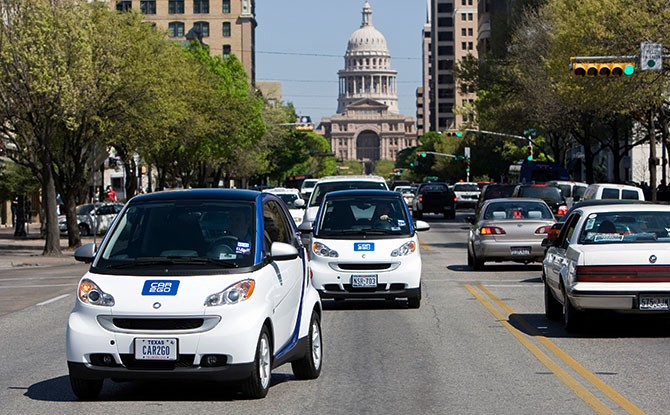

O melhor vem agora! Você pode estacionar o carro em qualquer estacionamento público (pago) e não pagar nada por isso. Graças a um convênio com a prefeitura da cidade. Por muito tempo Car2Go foi meu transporte nas horas de atraso.

Bom, a cidade até então tinha livre uso para Uber e Lyft, mas alguma votação estranha está tentando cancelar o uso das plataformas, lamentávelmente.

Por fim, se você pretende morar no centro e quer curtir aquela balada sem preocupação, sempre tem ônibus indo pra 6th street.

## Um estranho no paraíso

Bom, se você já viajou para algum lugar bem longe de onde você mora, sentiu um pouco a necessidade de se comunicar e conhecer mais pessoas da região.

Analisando alguns pontos estratégicos da cidade descobri algumas formas e atividades sociais para ajudar você a entender mais como funciona o comportamento das pessoas e até mesmo fazer novos amigos.

## Meetups

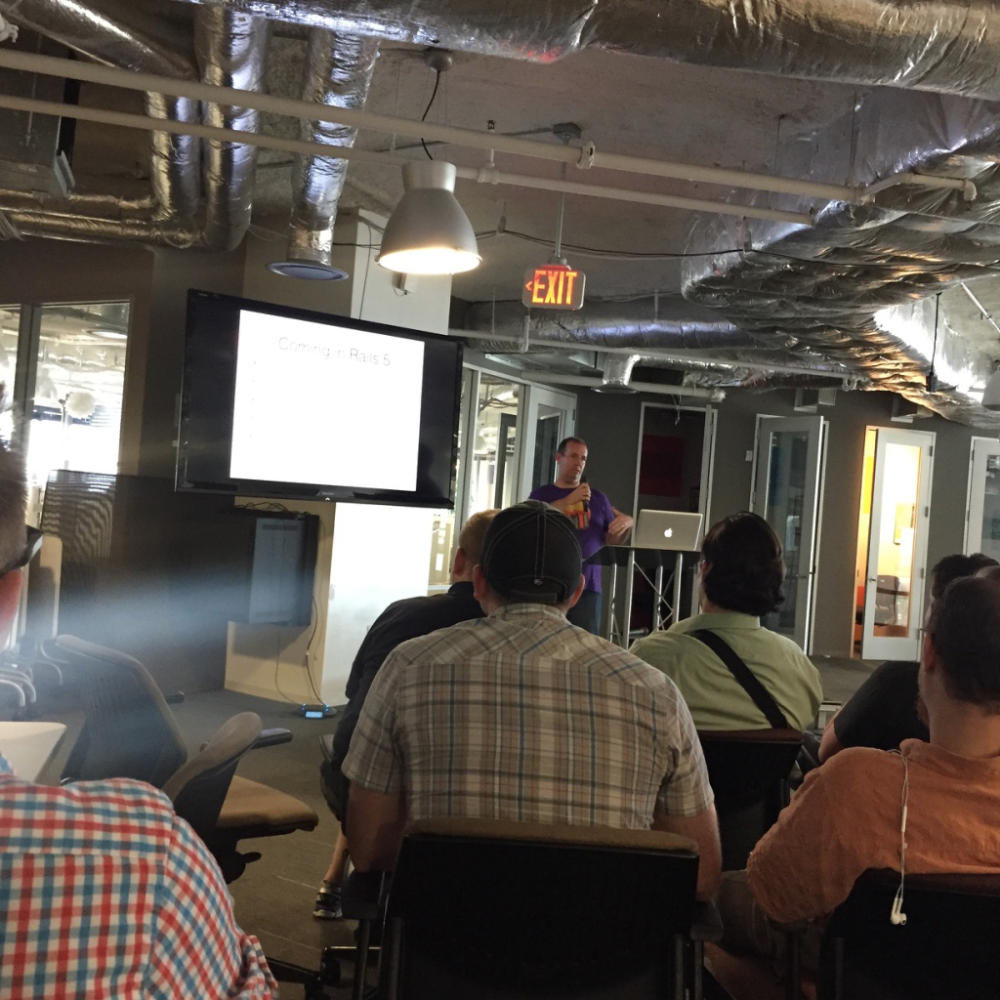

Aqui vai o Top 1 quando se trata de “coisas para salvar você em um dia de tédio”.

[Meetup](http://www.meetup.com/) é uma plataforma web onde pessoas criam grupos com interesses similares, Austin tem muita opção pra muita coisas que possivelmente você conhece ou tem interesse em conhecer.

E se você, como eu é da área de tecnologia, posso dizer que até agora Austin é uma das cidades com mais Meetups de tecnologias que eu vi. Tem pra todos os gostos e linguagens de programação, isso é muito bom.

Mas caso você queira algo mais fora da sua zona de conforto, é relativamente fácil encontrar Meetups sobre Esportes e até mesmo estilos de dança.

## Startups

Austin é bem conhecida pelo seu vasto ecossistema de startups e também pelo seu excitante Startup Weekend todos os anos. Tive a chance de participar e por incrível ainda ganhei o terceiro lugar na competição, o que foi ótimo para uma primeira vez.

Posso dizer que pelo menos 2 vezes por semana sempre tem algum evento interessante sobre empreendedorismo no qual pode com certeza agregar algum conhecimento ao seu negócio.

## FED (The Texas Federation of Women’s Clubs)

FED foi algo introduzido pela escola de inglês no qual estudei, é bem perto da escola e também muito incrível. Toda quinta feira pela noite eles ensinam como dançar alguns estilos musicais propriamente abraçados pelos Estados Unidos: Swing Dance e Lindy Hop, por exemplo.

Se você não conhece muita gente ainda, esse definitivamente é um ótimo lugar para fazer amizades e inclusive sair um pouco da sua zona de conforto e tentar aprender algo completamente fora do seu convívio.

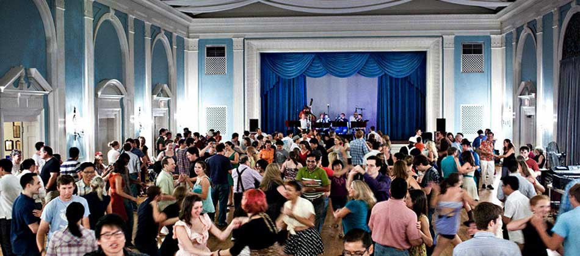

Por uma pequena taxa é possível aprender a dançar Swing Dance e socializar tranquilamente. É também possível trazer seus próprios drinks para consumir dentro do local.

A melhor é que não é necessário levar nenhum parceiro de dança.

É bem simples: Chame alguém pra dançar, geralmente ninguém é rude com você e aceita, criando um ciclo vicioso, pois você não para de dançar por horas, e é disso que se trata todo o processo, se divertir a noite toda.

## Futebol Americano

Foi em Austin que começou minha paixão por Futebol Americano, e incrivelmente toda a cidade torce mais para o time da universidade do que dos times estaduais.

Fui para um jogo do time local da UT, chamado de LongHorns, provavelmente o nome é dado por conta do mascote da universidade ser um Buffalo grandão.

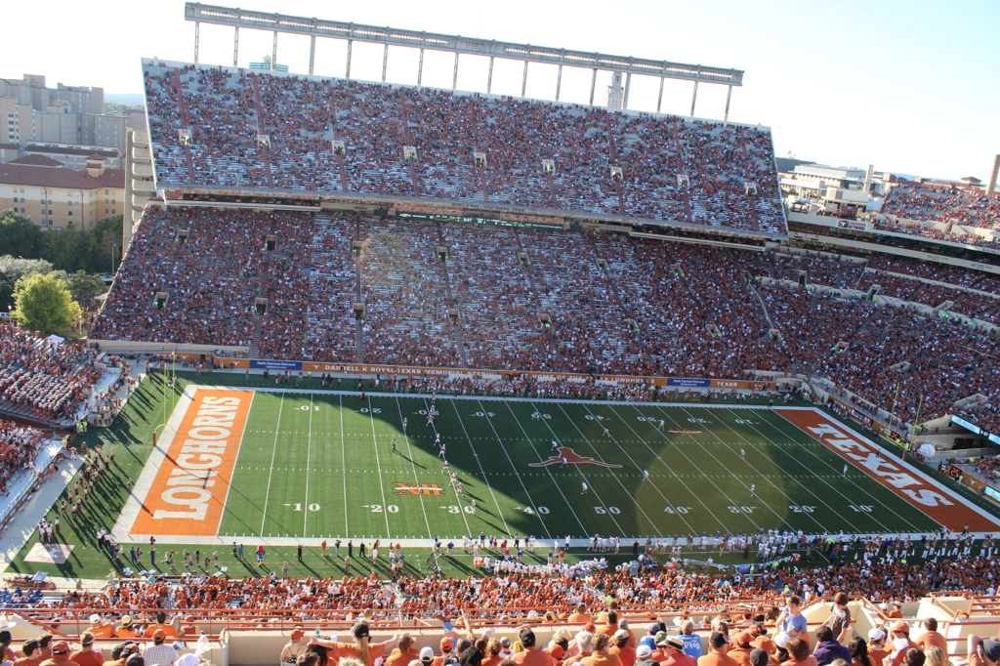

O incrível desse jogo é que 95% das pessoas no estádio estavam com camisa laranja torcendo para o time da Universidade.

Foi muito emocionante e deu pra ter toda a ideia de jogos com Cheerleaders e Bandas com formação no campo. Coisa que só da pra saber assistindo televisão no Brasil.

## Vida Natural

Um dos maiores aspectos que mudei na minha vida foi aprender a gostar mais da natureza, tanto para correr em um parque, nadar em uma piscina natural ou até mesmo curtir um por do sol com amigos.

Austin não deixa a desejar, na verdade ganha de muita cidade nos EUA quando se trata de lugares bonitos para passar o dia.

Posso citar vários lugares muito bonitos pra visitar em Austin e suas proximidades, tais como Blue Hole em Wimberley, Blue Hole em Georgetown, Jacob’s Well em Wimberley, Bull Creek District Park em Austin, McKinney Falls State Park em Austin, Hamilton Pool em Dripping Springs, etc. Comumente é Barton Springs que a maioria das pessoas visitam.

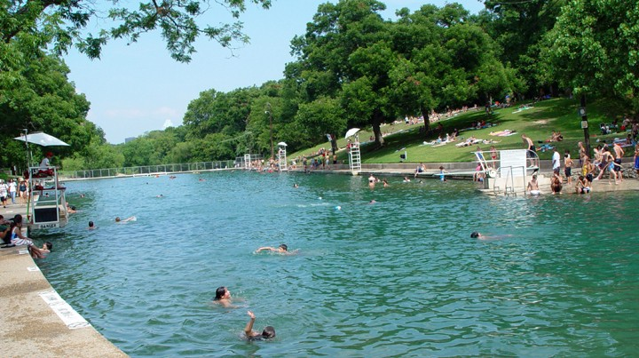

Se trata de umas piscina natural criada para visitas e entretenimento, onde todo o espaço é controlado e monitorado, evitando poluição excessiva e afogamentos. Definitivamente um ótimo lugar para visitar com sua família.

Definitivamente um ótimo lugar para passar a tarde, ler um livro, socializar com os amigos e entrar em contato com a natureza.

Fique atento que é proibido levar comida e bebidas para o local, isso ajuda a evitar poluição e afogamentos.

Um dos lugares mais bonitos que já vi e que não pode ficar de fora é o The Oasis.

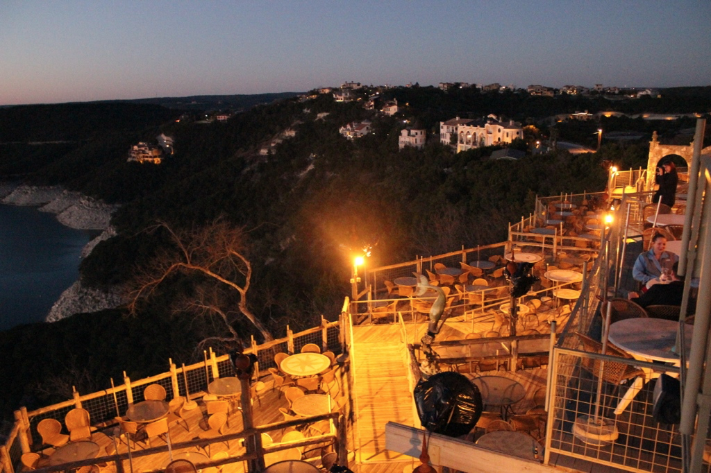

Se trata de um restaurante gigante com uma das visões mais bonitas em todos os Estados Unidos. É possível deliciar uma boa refeição e curtir um por do sol de tirar o fôlego. A imagem pode falar por si:

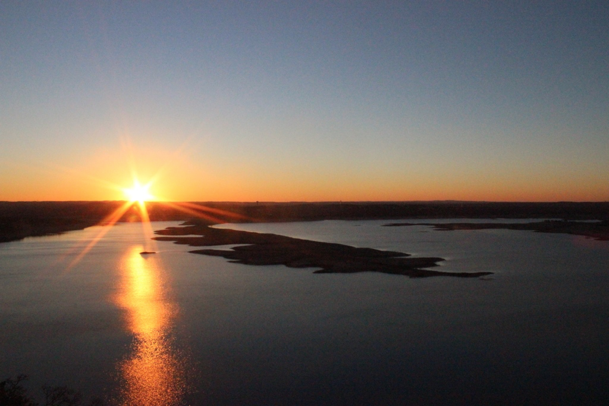

Por fim, um dos maiores parques da cidade é chamado Zilker Metropolitan Park. Sede do Austin City Limits é um dos maiores parques que já vi.

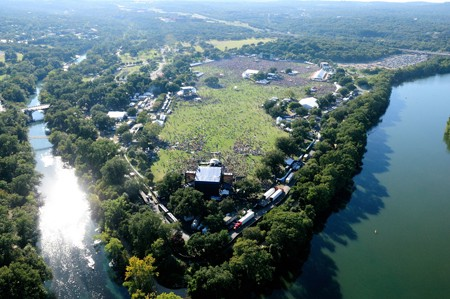

Muitas pessoas frequentam semanalmente para praticar esportes, fazer pique-nique, fazer caminhada e até nadar. O lugar é gigante e incrível. Definitivamente um lugar que deve estar na sua lista mesmo como visitante.

## Custo de Vida

Comparando com outros estados que visitei ou morei, posso dizer que Austin é consideravelmente mais barato. O preço médio de uma casa de 3 quartos na cidade fica em torno de \$230.000.

É fácil achar casas mais baratas, porém quanto mais perto do Centro da cidade, mais caras elas ficam. Infelizmente os impostos sobre propriedade em Austin são bem altos comparados ao resto do país.

A média de aluguel de um apartamento de 2 quartos é de \$1200, quanto mais perto de do centro da cidade, mais caro fica. Novamente, é possível achar bem mais barato do que isso, porém, depende muito da região que você quer morar.

Caso venha trabalhar em Austin, não existem taxas do estado do Texas, então, geralmente vai sobrar uma graninha extra caso você trabalhe remotamente para outro estado.

## Comunidade Brasileira

Pelo contrário do que muitos falam ou vem com o pré-conceito de que ir pra outro país e fazer amizade com Brasileiro é ruim. Posso confirmar que isso é uma ideia totalmente errada.

Nada melhor do que conhecer pessoas que falam seu idioma e infinitamente trocar experiências de como é viver longe de tudo que você está acostumado.

Costumo dizer que em primeiro lugar Mulheres de cabelo Rosa, e em segundo, Brasileiros são as pessoas mais legais do Mundo, isso n tem como negar.

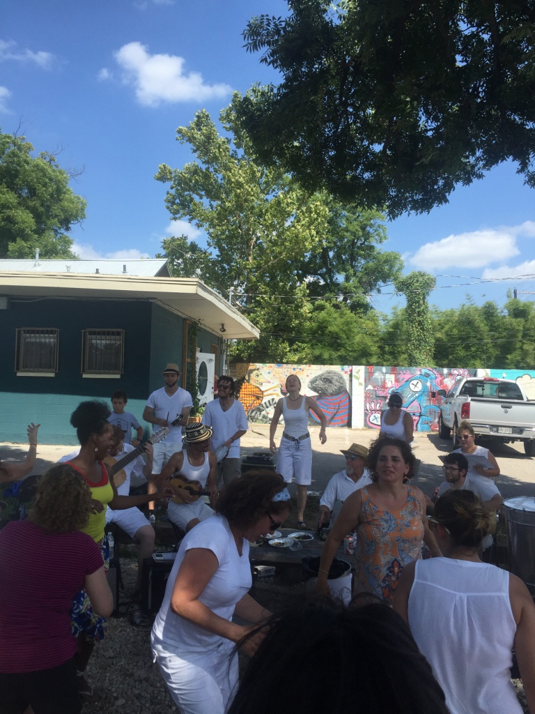

A comunidade Brasileira é bem grande em Austin, a maior que vi até agora na verdade.

Existe grupos no facebook que somam mais de 4 mil Brasileiros. Tem muita coisa boa acontecendo lá. Muitas ligadas ao Food Truck Brasileiro e a alguns restaurantes Brasileiros que facilmente você irá encontrar em Austin.

O que foi mais incrível pra mim de tudo isso, foi saber que existem algumas bandas de forró na cidade. Normalmente uma vez por mês é possível balançar o esqueleto ouvindo um ótimo forró pé-de-serra.

Isso acontece geralmente em um bar bem cultural chamado The Sahara Lounge.

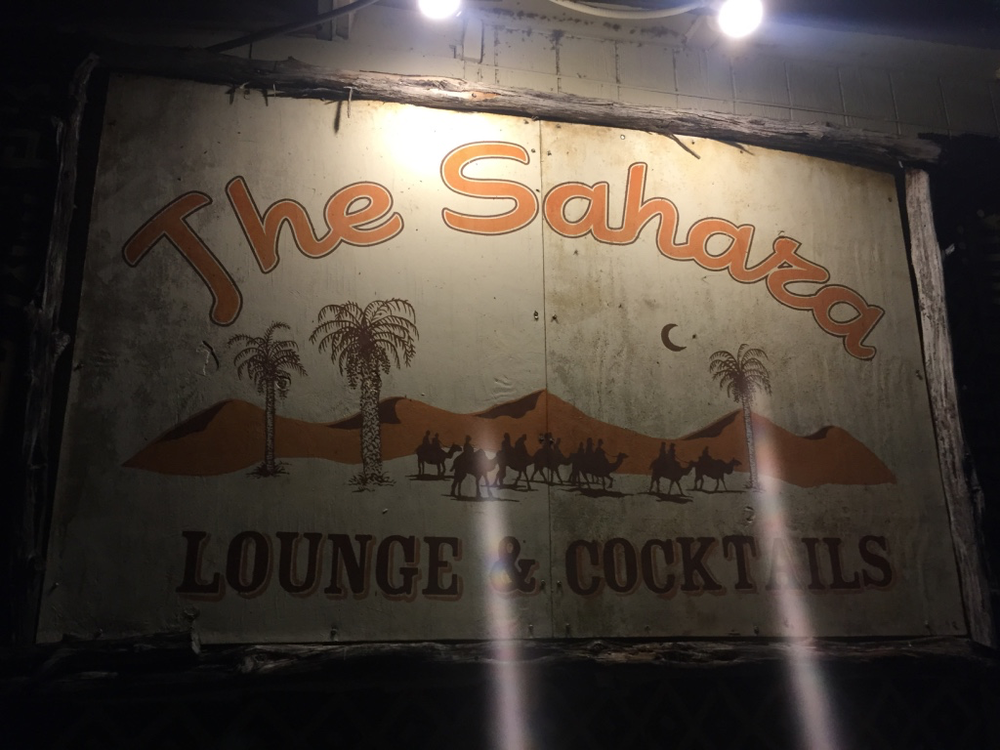

## Carnaval Brasileiro

Muitos não sabem, mas Austin hospeda anualmente um dos maiores carnavais Brasileiros dos Estados Unidos.

Em fevereiro anualmente acontece o [Samba Party](http://sambaparty.com/) (Carnaval Brasileiro) trazendo pessoas de todo o país, para comemorar essa festividade tão peculiar no Brasil. Não só Brasileiros, mas facilmente você vai encontrar muitos Americanos que adoram o nosso país. Isso é incrível!

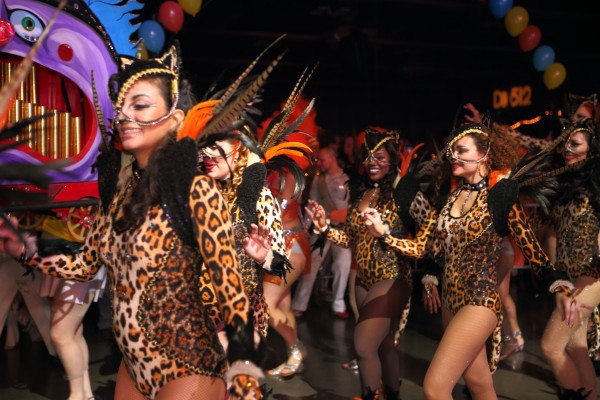

Felizmente a comunidade Brasileira aqui é bem unida, fiz muitos amigos, que por mim, vou levar pra vida toda. E é bem por aí. A vida de quem viaja nunca é a mesma, e assim espero que seja a minha, que mude constantemente.

Com certeza Austin-TX foi a cidade que mais mudou meu conceito sobre o mundo, e na minha concepção, mudou pra melhor.

Por fim, espero que tenham gostado desse meu “pequeno” (ou não) relato da minha experiência em Austin-Tx. Até o próximo post.
